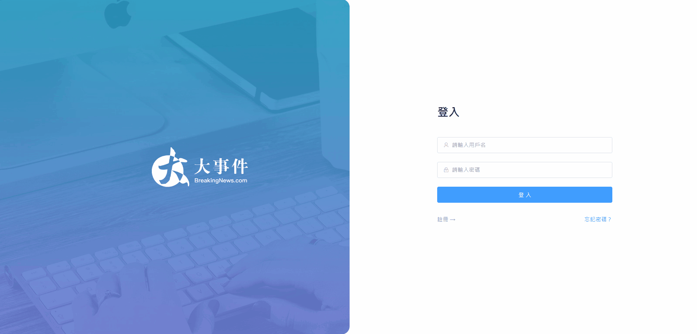
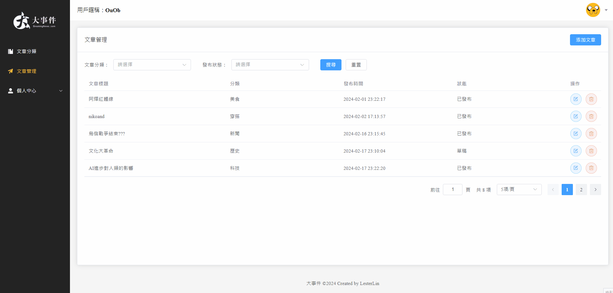
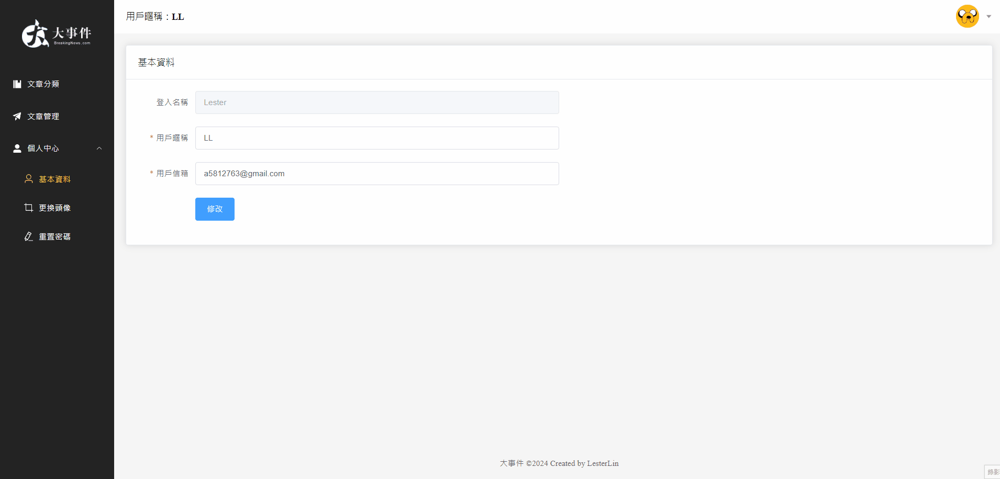
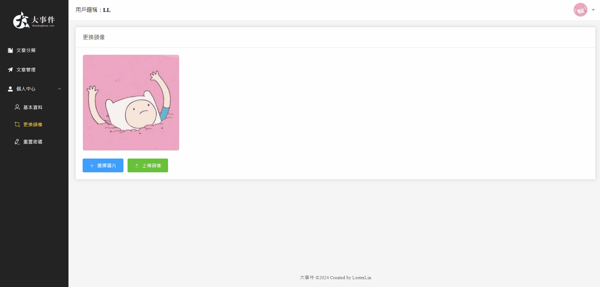
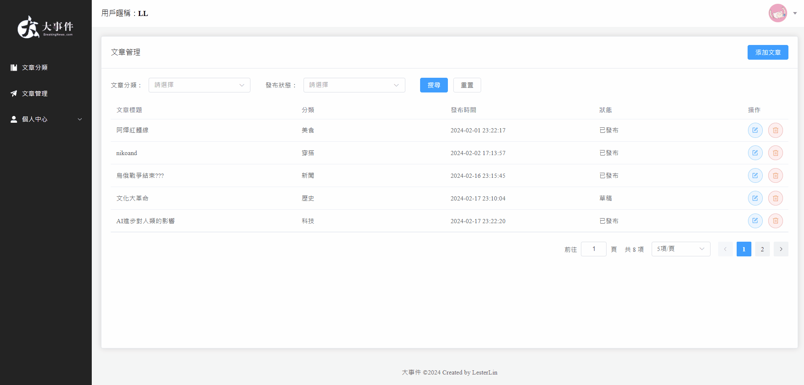

# Big-Event Article Management Backend System

This backend system designed for article creators, providing a simple and easy-to-use interface for CRUD of articles.

## Features

- User registration and login system 
- Forget password function with email reset 
- CRUD of article categories 
- CRUD of articles ( searchable by category or status, with customizable number of items per page)  
- Modification of personal basic information 
- Avatar change function 
- Password reset function 
- Logout and redirect to login page 

## Technology Stack

- Frontend: Vue3 with Composition API, pinia state management, vite rapid development tool, Element-Plus UI framework, and Axios for HTTP requests
-  Backend: Java17 and Spring Boot3 as backend development frameworks
-  Database: MySQL and Redis as database systems
-  Authentication: JWT (JSON Web Tokens) for authentication
-  Cloud Service: Amazon S3 for image storage
- RESTfull API ([API Doc](https://app.swaggerhub.com/apis-docs/NEWA5812763/BigEvent/1.0.0)
  )
- Docker & Docker Compose ([Docker Hub](https://hub.docker.com/repository/docker/lesterlinouo/big-event/general))

## Installation Guide

### Docker Deployment
   
#### 1. Install Docker Desktop

- Clone the repository
```bash
git clone https://github.com/Lester-1228/big-event.git
```
- Change directory to the cloned repository
```bash
cd big-event
```
- Start Docker containers
```bash
docker-compose up
```

#### 2. Visit http://localhost to view the application
You can directly register or use the following username and password to test the project
Username: Lester
Password: 123456

#### Contact me: newa5812763@gmail.com